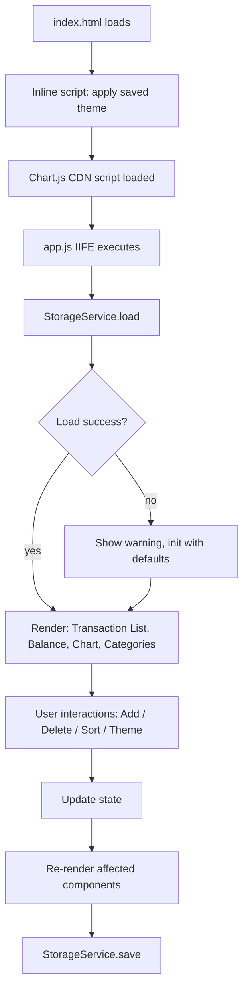

# Design Document: Expense & Budget Visualizer

## Overview

The Expense & Budget Visualizer is a single-page, client-side web application built with plain HTML, CSS, and Vanilla JavaScript. It requires no build step, no backend, and no framework — the user opens `index.html` directly in a browser. All data is persisted in the browser's Local Storage.

The app lets users record expense transactions (name, amount, category), view a scrollable transaction list, sort transactions, delete entries, and visualize spending distribution via an interactive pie chart. A dark/light mode toggle persists the user's theme preference.

**Key technical choices:**
- **Chart.js 4.x** (loaded via CDN — `https://cdn.jsdelivr.net/npm/chart.js@4.4.1/dist/chart.umd.min.js`) for the pie chart. Chart.js renders to HTML5 `<canvas>`, works in all target browsers, requires no build step, and supports the "Other" segment grouping needed by Requirement 7.7.
- **CSS Custom Properties** (`--var`) scoped under `[data-theme="light"]` / `[data-theme="dark"]` on the `<html>` element for theme switching. A small inline `<script>` in `<head>` reads the saved theme from localStorage and sets `data-theme` before any paint, preventing flash-of-wrong-theme.
- **One CSS file** (`css/style.css`) and **one JS file** (`js/app.js`) as required by Requirement 11.

---

## Architecture

The app is a single HTML page with a module-organized JavaScript file. Since no ES module bundler is used, `app.js` is structured as a single IIFE (immediately-invoked function expression) with clearly separated logical sections.

```
expense-budget-visualizer/
├── index.html          ← Entry point; loads css/style.css, Chart.js CDN, js/app.js
├── css/
│   └── style.css       ← All styles, CSS custom properties, responsive layout
└── js/
    └── app.js          ← All application logic (IIFE)
```

### Execution Flow



### Data Flow

All application state lives in a single plain object (`AppState`) in memory. Every user action mutates that state object and then calls the relevant render function(s). State changes are immediately persisted to localStorage via `StorageService`.

---

## Components and Interfaces

The JavaScript module is divided into the following logical sections:

### 1. `StorageService`

Responsible for all localStorage reads and writes. Wraps every operation in a try/catch to surface errors gracefully.

```js
StorageService = {
  KEYS: { TRANSACTIONS: 'ebv_transactions', CATEGORIES: 'ebv_categories', THEME: 'ebv_theme' },
  load()     → { transactions: Transaction[], categories: string[], theme: 'light'|'dark' }
  save(state) → void   // saves transactions, categories, theme; shows warning on failure
}
```

### 2. `AppState`

A plain object holding runtime state. Never accessed directly outside the controller functions — always mutated through dedicated functions that also trigger re-renders.

```js
AppState = {
  transactions: Transaction[],   // ordered by insertion (newest first)
  categories:   string[],        // default + custom category names
  theme:        'light' | 'dark',
  sortOrder:    'amount-asc' | 'amount-desc' | 'category-az',
  error:        string | null    // transient error message
}
```

### 3. `TransactionService`

Pure functions for transaction manipulation and validation.

```js
TransactionService = {
  validate(name, amountStr, category) → { valid: boolean, errors: string[] }
  add(state, name, amount, category)  → Transaction[]   // returns new array
  remove(state, id)                   → Transaction[]
  sort(transactions, sortOrder)       → Transaction[]   // stable sort
  computeBalance(transactions)        → number
}
```

### 4. `CategoryService`

Pure functions for category management.

```js
CategoryService = {
  DEFAULT_CATEGORIES: ['Food', 'Transport', 'Fun'],
  validateNew(name, existing) → { valid: boolean, error: string | null }
  add(existing, name)         → string[]   // returns new array
  remove(existing, name)      → string[]
}
```

### 5. `ChartService`

Aggregates transaction data into Chart.js-compatible datasets.

```js
ChartService = {
  aggregate(transactions) → { labels: string[], data: number[], colors: string[] }
  // Groups top 10 categories by spend; remainder → 'Other'
  // Excludes transactions with amount <= 0
}
```

### 6. Render Functions

Thin DOM-manipulation functions. Each accepts current state and updates only the relevant DOM subtree.

```js
renderTransactionList(transactions, sortOrder) → void
renderBalance(transactions)                    → void
renderChart(transactions)                      → void   // creates or updates Chart.js instance
renderCategories(categories)                   → void   // populates <select> options
renderTheme(theme)                             → void   // sets data-theme on <html>
showError(message, targetEl)                   → void
clearError(targetEl)                           → void
```

### 7. Event Handlers / Controller

Wires DOM events to service calls and render updates. Lives at the bottom of the IIFE after all services and render functions are defined.

---

## Data Models

### `Transaction`

```js
{
  id:        string,   // crypto.randomUUID() or Date.now() + Math.random() fallback
  name:      string,   // 1–100 characters
  amount:    number,   // 0.01–999,999,999.99, stored as float
  category:  string,   // one of the categories in AppState.categories
  createdAt: number    // Unix timestamp (ms), used for default sort order
}
```

### `AppState` (persisted subset)

Only `transactions`, `categories`, and `theme` are written to localStorage. `sortOrder` and `error` are ephemeral — `sortOrder` resets to `'amount-asc'` on load per Requirement 4.2.

### localStorage Schema

| Key | Value type | Example |
|---|---|---|
| `ebv_transactions` | JSON array of `Transaction` | `[{id,name,amount,category,createdAt}]` |
| `ebv_categories` | JSON array of strings | `["Food","Transport","Fun","Rent"]` |
| `ebv_theme` | string | `"dark"` |

### Chart Data Aggregation

Category spending is computed as:

```
categoryTotals = Map<categoryName, sum(amount)>  (amounts > 0 only)
sorted by total descending
top 10 → individual segments
rest   → summed into "Other" segment (only if remainder exists)
```

Percentage labels are rounded to 1 decimal place via `toFixed(1)`.

---

## Correctness Properties

*A property is a characteristic or behavior that should hold true across all valid executions of a system — essentially, a formal statement about what the system should do. Properties serve as the bridge between human-readable specifications and machine-verifiable correctness guarantees.*

### Property 1: Balance equals sum of all amounts

*For any* list of transactions, the computed balance SHALL equal the arithmetic sum of all transaction amounts, and SHALL be 0.00 when the list is empty.

**Validates: Requirements 6.1, 6.4**

---

### Property 2: Valid transaction inputs are accepted; invalid inputs are rejected

*For any* combination of item name (1–100 chars), amount (0.01–999,999,999.99), and category, form submission SHALL succeed and add the transaction. *For any* submission where the name is empty/whitespace-only, the amount is outside the valid range, or the category is empty, submission SHALL fail and the transaction list SHALL remain unchanged.

**Validates: Requirements 1.4, 1.5, 1.6**

---

### Property 3: Duplicate and empty categories are rejected

*For any* category name that is already present in the category list (case-insensitive), or any empty/whitespace-only string, adding it as a custom category SHALL fail and the category list SHALL remain unchanged.

**Validates: Requirements 2.3, 2.4**

---

### Property 4: Sort preserves all transactions

*For any* list of transactions and any valid sort order, sorting SHALL produce a list containing the same set of transactions (no additions or removals), with ties in amount broken by original insertion order.

**Validates: Requirements 4.3**

---

### Property 5: Chart aggregation top-10 grouping invariant

*For any* set of transactions with more than 10 distinct categories, the aggregated chart data SHALL contain exactly 11 segments (10 named categories + 1 "Other"), and the sum of all segment values SHALL equal the sum of all positive transaction amounts.

**Validates: Requirements 7.1, 7.7**

---

### Property 6: Add/delete transaction round trip

*For any* transaction that is added and then immediately deleted, the resulting transaction list, balance, and chart data SHALL be identical to their states before the transaction was added.

**Validates: Requirements 5.2, 5.3, 5.4, 8.1, 8.2**

---

### Property 7: localStorage serialization round trip

*For any* valid AppState (transactions + categories + theme), serializing to localStorage and then deserializing SHALL produce an equivalent state (same transactions, categories, and theme) with no data loss.

**Validates: Requirements 8.5**

---

## Error Handling

| Failure scenario | Requirement | Behavior |
|---|---|---|
| localStorage unavailable on load | 8.6, 9.6 | Show warning banner; initialize with empty transactions + default categories + light theme |
| localStorage write failure | 8.7 | Show warning banner; keep in-memory state unchanged |
| localStorage unavailable on delete | 5.5 | Show error; do NOT remove transaction from UI or state |
| Custom category load failure | 2.6 | Show error; display default categories only |
| Chart.js CDN fails to load | — | Hide chart area; show inline message "Chart could not be loaded" |
| Invalid form input | 1.5, 1.6, 2.3, 2.4 | Show inline validation message next to the offending field; do not submit |

All error messages are displayed in an accessible `role="alert"` element so screen readers announce them. Transient errors (form validation) are cleared when the user corrects the input or resets the form.

---

## Testing Strategy

This is a client-side Vanilla JS application with no test runner configured. Testing is split into:

### Unit Tests (Manual / Browser Console)

Focus on the pure service functions. Because all business logic is isolated in `TransactionService`, `CategoryService`, and `ChartService`, each function can be called directly from the browser console or a simple test HTML page without a test framework.

Key example-based tests to verify:
- `TransactionService.validate` rejects empty name, zero amount, out-of-range amount
- `TransactionService.sort` with ties preserves insertion order
- `CategoryService.validateNew` rejects duplicates case-insensitively
- `ChartService.aggregate` returns "Other" segment when > 10 categories
- `ChartService.aggregate` excludes transactions with `amount <= 0`
- `StorageService.load` returns defaults when localStorage is empty or throws

### Property-Based Tests

The pure functions in `TransactionService` and `ChartService` are well-suited to property-based testing. If a test runner is added in the future, the following properties map directly to test implementations using a PBT library (e.g., [fast-check](https://github.com/dubzzz/fast-check)):

| Property | Key generator inputs |
|---|---|
| Property 1: Balance sum | `fc.array(fc.float({min:0.01, max:999999999.99}))` |
| Property 2: Validation gate | `fc.string()` × `fc.float()` × `fc.string()` |
| Property 3: Duplicate categories | `fc.array(fc.string())`, case-varied duplicates |
| Property 4: Sort preserves set | `fc.array(transactionArb)` × `fc.constantFrom(sortOrders)` |
| Property 5: Top-10 grouping | `fc.array(transactionArb, {minLength: 11 distinct categories})` |
| Property 6: Add/delete round trip | `fc.record({name, amount, category})` |
| Property 7: localStorage round trip | `fc.record({transactions, categories, theme})` |

Each property test should run a minimum of 100 iterations.

### Integration / Manual Smoke Tests

End-to-end flows that must be verified manually in the browser:

1. **Full add flow**: Fill form → submit → verify list, balance, chart, localStorage all update
2. **Delete flow**: Delete a transaction → verify list, balance, chart, localStorage all update
3. **Custom category persistence**: Add category → reload page → verify it reappears
4. **Theme persistence**: Toggle theme → reload → verify theme restores before paint
5. **Sort order**: Add 3 transactions with different amounts → try all 3 sort options
6. **Overflow / "Other" segment**: Add transactions with > 10 distinct categories → verify chart groups correctly
7. **Empty state**: Clear all transactions → verify empty-state messages in list and chart
8. **Storage failure simulation**: Override `localStorage.setItem` to throw → verify warning messages appear
9. **Responsive layout**: Test at 320px, 768px, 1280px viewport widths
10. **Keyboard navigation**: Tab through all interactive elements; verify focus indicators
